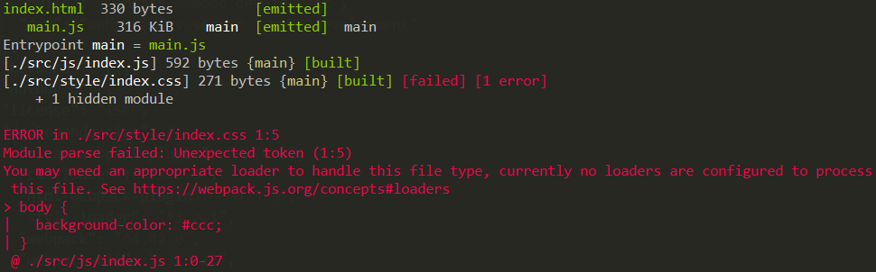

# 加载特殊资源
  webpack默认只处理打包js语法的代码，其他的文件webpack并不支持。例如我们在入口文件中加载css代码，在打包的时候将会报错：

  ```
  |-- src
  |   |-- style
  |       |-- main.css
  |   |-- index.js
  |-- index.html
  |-- package-lock.json
  |-- package.json
  |-- webpack.config.js
  ```

  ```javascript
  /* index.js */
  require('./style/main.css')
  ```

  

  如果将css文件中的内容改成js语法的代码，webpack打包将不会报错，这说明webpack在打包过程中默认将遇到的所有文件都当做js的代码语法进行解析。