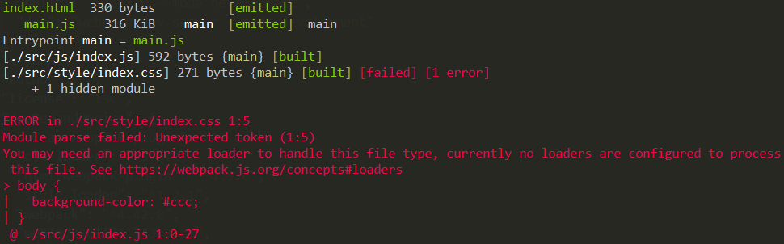

[toc]

上一节内容介绍了模板自动注入bundle文件，并使用在本地启动开发服务的形式提高开发效率。此时还未引入css、img等非js的文件，webpack默认只打包构建js语法的内容。那引入非js的内容会发生什么呢？尝试一下在上节内容的基础上，我们在入口文件(/src/js/index.js)中引入css代码:

```javascript
import '../style/index.css'
import $ from 'jquery'

// ......
```

现在的目录结构是这样的: 

```javascript
|-- src
|   |-- js
|       |-- index.js
|   |-- style
|       |-- index.css
|-- main.html
|-- package-lock.json
|-- package.json
|-- webpack.config.js
```

 尝试一下打包，如果不出意外的话，应该会报错：



如果将css文件中的内容改成js语法的代码，webpack打包将不会报错，这说明webpack在打包过程中默认将遇到的所有文件都当做js的代码语法进行解析。

# 使用loader加载css

webpack想要实现的是整个前端项目的模块化，不只是js文件属于模块，一个css文件，一个图片文件，甚至是一个字体文件都应该是需要被管理的模块。那有的人可能就要问了，为什么webpack本身不支持css的打包管理呢。这样是为了更好的维护webpack，我们在开发过程中也会下意识的遵循单一职责原则，这样就可以将庞大的任务分解开来，一段代码只负责其中的某一个任务。这样也将这部分内容解耦出来。

试想一下，如果webpack本身也支持了css打包，图片模块是不是也要支持，那以后新出现一种新的前端内容作为模块是不是又要重新改造webpack了？因此将这部分内容抽出来也更加方便扩展。

因此webpack使用loader机制加载非js的特殊资源。像css的文件可以使用css-loader加载，css-loader只是处理css文件，将其打包到bundle，但并不负责将其插入到html中，因此使用style-loader将css插入到head标签中，这时才能在页面显示出css的效果。先体验一下css打包的过程吧，安装css-loader和style-loader并修改webpack配置：

```javascript
module: {
  rules: [
    {
      test: /\.css$/i,
      use: [
        'style-loader',
        'css-loader'
      ]
    }
  ]
},
```

也不是很难