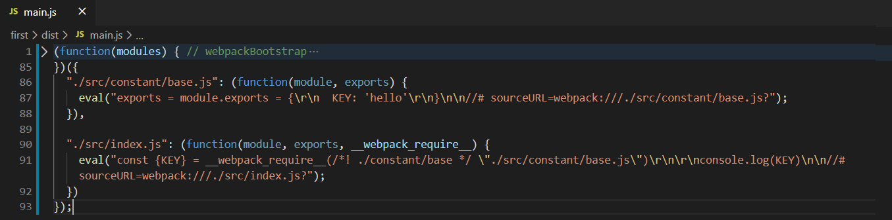
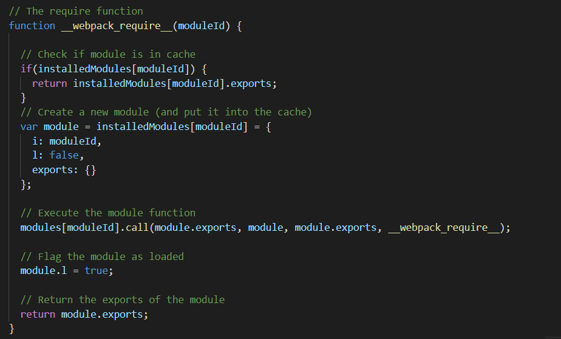
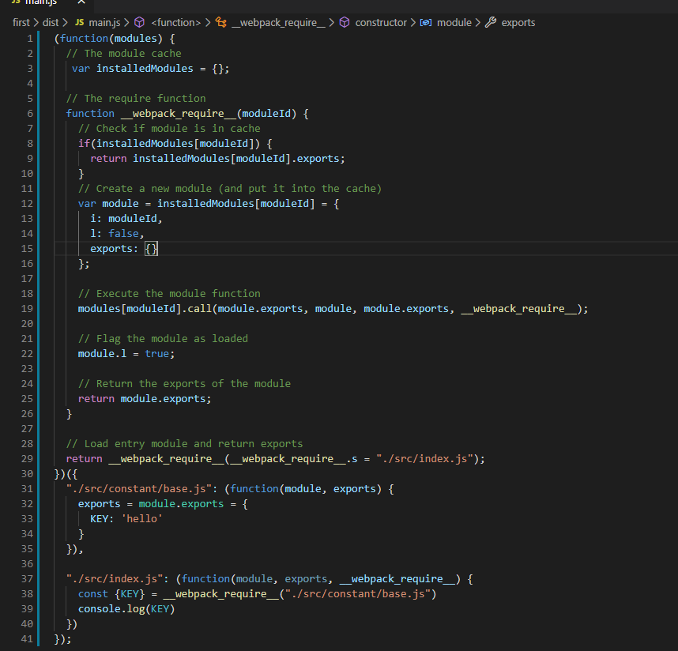

本文目录
[toc]

# webapck简单介绍
  webpack是一款自动化的开发工具，他帮助开发人员做一些重复性的工作，有效地提高开发效率，并发挥一定作用来提升访问性能。那他到底都有啥特点，直接上干货介绍：

  - 打包
    webpack众多作用中最重要的用途之一，比如一个项目中引入了众多js文件，webpack可以从入口出发将众多js文件打包成一个，这样将显著提高加载性能。让人兴奋的是，webpack不仅仅能够打包js文件，他甚至可以将css样式文件、woff字体文件、png等图片文件打包为一个文件。这当然很不错，不过万事有利有弊，打包的东西多了文件体积就会过于庞大，但开发webpack的这种大佬会想不到这种问题吗？
  
  - 压缩
    一般开发源码为了方便阅读会有很多空格/换行/注释等，webpack会将源码压缩，剔除这些无用的东西达到很小的体积，当然webpack不知压缩代码这么简单，图片等文件也可以进行压缩

  - 编译
    像less/scss等文件，浏览器是不认识这些东西的，通过webpack的编译就可以将其转换为浏览器认识的东西。还有像ES6等某些高级的语法在某些浏览器下可能不支持，那就可以通过webpack的某些插件将其编译为ES5的语法
  
  - 生成
    生成生产环境下的代码，这个就不多说了。

    ......

  以上，只是列举webpack的一些基本特点，甚至于webpack还可以在服务器端用于node开发。当然，webpack本身并不具备这么强大的功能，这款工具的强大得益于庞大的plugin及loader群体（可能用群体这个词不合适），废话不多说，进入下一个主题。

# webpack本质
  大多数工具的出现其实都是在特定场景下解决某种问题的，这里就来简单介绍webpack解决了什么痛点。

  由于历史原因，js起初本是一种在浏览器上运行的解释型脚本语言，且并不支持模块化的机制。当项目庞大到一定的规模，管理起来伴随着的可能就是效率低下，维护成本剧增等等。举例来讲，前端的一个下拉框中的数据可能多处用到，但是在数据库中存储的也可能是一种选项对应值的mapping关系，这种mapping可能不止一处，那就可以分离出来单独做个mapping的const变量。这种模块化的思想一直以来都是存在的，但是在前端的实现并不是简单的。关于模块化的历史发展：

    文件划分（script分别引入） --> CommonJS规范（在node端，并不只用浏览器端） --> AMD（requirejs）--> CMD（seajs）--> module（ES6）

  那么webpack最初的目标就是实现前端项目的模块化，它解决的问题就是如何在前端项目中更高效地管理和维护每一个资源。它的本质仍然是一个模块化的打包工具，通过万物皆模块的设计思想实现了整个项目的模块化。

  一句话，webpack实现了一种模块化的机制。

# 第一个webpack项目
  学一个东西的目的当然是用于项目开发，没有目的性的学习只会让人学的疲惫不堪。本次系列文章的最终目的是使用webpack从零搭一个前端项目结构出来。文中介绍的有不妥之处，还请多多指教共同学习进步。

  ## 安装
  要使用webpack第一步肯定是要安装了，安装过程及其简单，万人都会的`npm install webpack`就搞定。但是一般我们是建议将webpack安装在本地，也就是说安装在当前目录下的node_modules目录下而非全局安装，这样方便在引入某些依赖的同时升级项目。另外，由于我们介绍的webpack4.x的版本，还需要安装webpack-cli。因为从webpakc4.x开始，webpack将一部分功能集成与cli之中

  **但是，在安装之前要记得`npm init -y`。**这样就可以生成一个记录项目依赖的package.json文件。关于package.json各字段的说明可以看我的另一篇[博客](https://segmentfault.com/a/1190000017225130 "博客")。既然此文件是收集依赖的，那webpack也属于我们在开发时的一个依赖，因此在初始化一个package之后就要使用`npm i webpack webpack-cli -D`将webpack和webapck-cli安装在本地并成为开发依赖。

  ## webpack零配置初体验
  安装好之后就可以开搞了，先使用webpack做一个最简单的项目，在项目源码js文件中使用jquery向页面输出`hello webpack`。记得先安装jquery哦，因为jquery在上线时也要用到，因此这里作为本地依赖下载: `npm i jquery -S`。

  在项目目录下创建一个src的目录，在src下新建一个index.js文件，在index.js中就可以任意发挥了。

  ```javascript
    // index.js文件
    import $ from 'jquery'

    $(function() {
      $(document.body).text('hello webpack')
    })
  ```

  之后运行npx webapck你就可以看到在当前目录下生成的dist目录了，这就是webpack打包之后的结果。然后在项目根目录下新建index.html文件引入dist下的main.js就可以看到结果了。目录结构应该是这样：
  ```
  |-- dist
  |   |-- main.js
  |-- node_modules
  |-- src
  |   |-- index.js
  |-- index.html
  |-- package-lock.json
  |-- package.json
  ```

  ## npx简单介绍
  npx的出现是为了能够在命令行调用项目内部安装的模块，就比如此处的webpack，只能在项目脚本或者package.json的script字段里面调用，如果想在命令行调用此处的webpack就必须使用`node_modules/.bin/webpack --version`，npx的出现就是为了解决这个问题，直接使用：`npx webpack --version`就可以了。

  npx在运行时会到node_modules目录下和环境变量中检查命令是否存在。

  ## npx webpack发生了啥
  命令行键入npx webpack后会寻找node_modules/.bin/webpack.cmd并执行，webpack.cmd之中的内容大概是讲用node去运行node_modiles/webpack/bin/webpack.js这个文件。这个文件中首先会检测是否安装了webpack-cli或者webpack-command（只安装一个便可），如果没有安装便提示安装，如果全部安装了则提示你装了两个让你卸载一个或者用他们其中之一的二进制命令直接运行。因此webpack4.x的版本一定要安装了webpack-cli才可以运行。

# webpack打包结果
  ## 生成后的代码
  为了深入理解webpack的运行原理，接下来研究一下webpack打包后生成的bundle文件。为了研究简单，我们先使用commonjs规范，另外把src/index.js文件做一下修改后执行`npx webpack --mode development`(配置的后面再介绍)：

  ```javescript
    const {KEY} = require('./constant/base')

    console.log(KEY)
  ```

  在src目录下新建一个constant的目录再新建一个base.js的文件，此文件中输出一句话：

  ```javescript
    exports = module.exports = {
      KEY: 'hello'
    }
  ```

  下图是webpack打包后的文件将其代码全部折叠后的状态：

  

  可以看到打包后的代码其实就是一个立即执行函数，他接收一个modules参数，在立即执行时传入了一个对象，这个对象的key是左右文件的相对于当前执行命令的路径，value是一个函数。展开这个立即执行函数可以看到，内部首先声明了一个installedModules的对象缓存已经加载的模块，并定义了一个require函数，这个函数接收一个moduleId作为参数，还在其上面挂了一些其他数据和工具函数，最后执行这个require函数传入了入口文件的路径并返回其结果。

  ## require函数
  下面来分析一下require函数：

  

  require函数也很简单。首先会检查时候已经加载过本次需要require的模块，如果已经加载了直接返回导出的部分。否则将当前加载模块的路径作为缓存列表的key值加入缓存中，接下来使用call执行当前模块的同时传入当前模块以及当前模块要将导出的对象和require函数。
  
  为了清晰分析，我们把立即执行函数实参中的eval以及其中的\r\t等符号还有暂时不需要用到的require函数的属性都去掉就可以看到如下的代码：

  

  到这里已经很清晰了，实际上就是webpack实现了一套模块化的机制，这与node的commonjs规范如出一辙（当然我们这里使用的也是commonjs的导出模式），webpack也实现了es6的模块机制，关于es6模块的实现后面再讲到，这里的目的是先认识一下webpack的主要实现原理（关于commonjs的加载原理这里不再赘述，有兴趣的可以参考阮一峰老师ES6入门书籍的Module的加载实现一节中有介绍到commonjs的加载原理）。

# 总结
  webpack本质上是一个解决了浏览器端模块化机制的打包工具，他以“万物皆模块”的思想将所有的模块打包成一个文件输出。除此之外，他还有着丰富的piugin和loader机制对相关文件进行优化并编译打包。

  写在最后：因作者水平有限，上述如有表述不对之处以致误导读者，请广大coder不吝赐教，及时批评指正。我将及时修改，真正做到不误导！